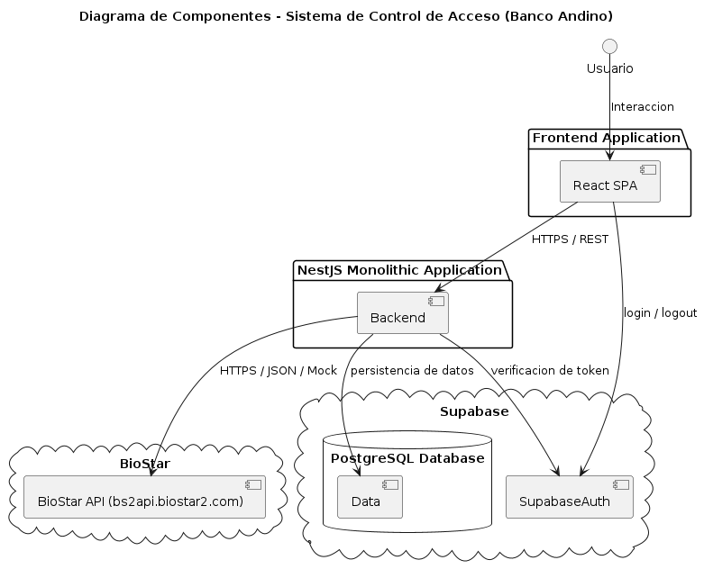

# **Documento de Definición de Arquitectura**

*Sistema de Control de Acceso a Instalaciones --- Banco Andino*

## Introducción

Este documento los aspector de arquitectura y diseño del sistema de control de acceso a instalaciones del Banco Andino. Se detallan los detalles de la arquitectura del sistema, las opciones que se tomaron en cuenta para las desiciones de arquitectura y aspectos de diseño que se tienen en cuenta.

## Arquitectura

El sistema utiliza una arquitectura distribuida por capas basada en el modelo Cliente-Servidor. Esta distribución separa las responsabilidades de la interfaz de usuario, la lógica de negocio y el almacenamiento de datos, lo que permite cumplir con el requisito de portabilidad para operar tanto en servidores propios del banco como en la nube en el futuro, a continuacion se detallan los componentes existentes dentro del mismo y como se comunica:

1. Frontend (Capa de Presentación)

Es una aplicación de página única (SPA). Se ejecuta directamente en el navegador web del usuario. El frontend se comunica con el backend mediante una API RESTful para interactar con los servicios que el sistema ofrece. Para esta capa se usa React (ya que este es una restricción definida), y se eligio usar Vite usando TypeScript para usar tipado mas estricto de forma que se pueda mejorar la experiencia de desarrollo.

2. Backend (Capa de Aplicación)

Es un servidor único estructurado como un Monolito Modular. Este centraliza todas las reglas de negocio, las validaciones de archivos Excel, el control de accesos y la seguridad del sistema. El proyecto cuenta con un alcance acotado a cuatro épicas principales (empleados, catálogos, eventos y autenticación) y se implementará inicialmente para seis sedes fijas, esto permite organizar el código en módulos independientes, lo que reduce la complejidad de desarrollo y se adapta perfectamente al uso obligatorio de una única base de datos PostgreSQL. Además, deja el sistema preparado para añadir fácilmente en el futuro módulos como contratistas, visitantes o aforo por áreas sin añadir complejidad innecesaria o problemas internos por dependencias.

3. Base de Datos (Capa de Datos)

Es una instancia dedicada del motor relacional PostgreSQL (tambien es una restricción definida). Su función exclusiva es almacenar de manera persistente la información de los empleados, los tipos de documento, el historial de eventos de acceso y los usuarios del sistema.

## Consideraciones de arquitectura tomadas en cuenta

La capa de aplicación no tenia restricción en cuanto a su definición, por lo que para esta se consideraron varias opciones para diseñar y definir como se estructuraria en este componente dentro del sistema. A continuación se detallan las opciones consideradas para este componente:

* **Monolito por capas:** Organizado en un único servidor en donde todos los módulos se organizan bajo capas de presentación, lógica de negocio y acceso a datos. Esta permite un despliegue sencillo, pero dificulta la organización interna y añadir más módulos en el futuro podría ser más difícil de controlar. Esta ultima razón fue la que motivó principal por el cual se descartó esta opcion, ya que se buscaba una arquitectura con un manejo mas flexible de módulos de forma que se pueda agregar y módulos sin afectar todo el sistema.

* **Monolito modular:** Organizado en un único servidor de la misma forma que el anterior, pero con módulos internos claramente definidos y con posibilidad de diseño con acoplamiento débil, este permite estableciendo límites claros entre los diferentes dominios y una mejor opcion de escalar la cantidad de modulos que se poden agregar en el futuro. Esta es la opción que mejor se acomoda si se tiene en cuenta que en un MVP que no tiene tantas funcionalidades y complejidad muy alta, ademas que permite desacoplar los modulos y posibilidad de escalarlos en el futuro, de igual forma reduce la complejidad de desarrollo y despliegue.

* **Microservicios:** Este organiza varios servidores como servicios desplegables de forma independiente, cada uno con un propósito diferente; permite una mejor escalabilidad horizontal, aisla las fallas entre los servicios y permite usar más tecnologías de forma independiente. Esta arquitectura ofrece varios beneficios que las anteriores no ofrecen, pero en el contexto del proyecto, desarrollar microservicios para este MVP elevaría drásticamente la complejidad de despliegue, y posiblemente la latencia de red y la gestión de transacciones. Las características que se deben implementar no presentan una necesidad de escala masiva que justifique dividir las funciones en servidores independientes. Por otro lado, aunque no se definió bien qué tanto necesita escalar el sistema en cuanto a recursos debido a la cantidad de usuarios y/o peticiones en un mismo momento dado, por las funciones que se manejan, que son principalmente para personal del banco que maneja y necesita información de los empleados para llevar a cabo sus tareas, el número de usuarios posiblemente es limitado y podría no necesitar escalar en gran medida los recursos.

* **Arquitectura Hexagonal:** Esta es una alternativa que se puede usar en conjunto con las alternativas anteriores (pede aplicarse tanto a un monolito como a microservicios), en esta se aísla la lógica de negocio de los detalles de infraestructura mediante interfaces y sus implementaciones, lo que permite un menor acoplamiento y mayor reusabilidad. Analizando esta opcion se puede obtener un mejor manejo para operaciones algo mas complejas de gestionar como la interaccion con BioStar (tanto simulada como real), pero al mismo tiempo podria traer problemas de sobreingeniería sobretodo en los módulos que son mas que todo operaciones CRUD (que son mas simples), por lo cual no se justifica su uso, del mismo modo necesita una mejor definición en cuanto a su diseño lo que tambien podria hacer mas complejo el desarrollo.

* **Arquitectura orientada a eventos:** Esta alternativa también se puede usar en conjunto con las alternativas anteriores, en esta los componentes se comunican utilizando eventos asíncronos, ya sea a través de un bus de eventos o un broker de mensajería. Esta opcion seria muy util para procesos de sincronización con BioStar, e incluso el procesamiento de cargue masivo de empleados de forma que los usuarios no perciban bloqueos si el proceso se demora mucho en ejecutarse, pero al mismo tiempo introduce problemas de gestion de infraestructura y despliegue al añadir mas componentes y mecanismos de comunicación. Esta es una opción que no se podria descartar del todo, tal vez se pueda necesitar implementar en el futuro, pero por el momento principalmente por simplicidad no se justifica su uso.

* **Serverless:** Esta alternativa permite la ejecucion de procesos bajo demanda, escaladas y administradas por el proveedor de nube, esta permite una menor administración de servidores, de uso recursos, escalamiento automático y buen ajuste para tareas programadas o esporádicas. Aunque esta alternativa presenta varios beneficios, se puede usar en la nube y podria no presentar una gran complejidad en cuanto al desarrollo, se descarta debido a que se debe poder operar el sistema en los servidores propios del banco, por lo que dificulta la operacion on-premise.

## Tecnologías

* **Autenticación:** Se decidio usar Supabase Auth, una solución de autenticación de terceros que ofrece un control de acceso sencillo, y que tambien permite el despliegue de la DB de postgres, por lo que permite facilidad en cuanto a el despliegue. De igual modo se tiene en cuenta consideraciones para poder agregar facilmente otro proveedor de autenticación.

* **Backend:** Nestjs y TypeScript. Para este caso, se escogio Nestjs principalmente debido a que su arquitectura nativa está diseñada de forma que es muy compatible para construir monolitos modulares organizados y mantenibles. Por otro lado, al utilizar TypeScript, comparte el mismo lenguaje del ecosistema de React, que es el frontend obligatorio del proyecto. Esto a suvez permite que el equipo interno de Infraestructura TI (que maneja React) pueda darle continuidad y mantenimiento al sistema de forma sencilla. Del mismo modo es un ecosistema maduro y con soporte para ofrecer inyección de dependencias que facilitan implementación y escalabilidad modular.

## Aspectos de diseño tomados en cuenta

* **Uso de patrón Strategy:** El patrón strategy puede ser util para poder desacoplar las dependencias en cuanto a la sincronizacion con BioStar y la Autenticación. Se puede usar clases abstractas o infertaces para definir los métodos necesarios con los se que se interactue con BioStar de forma que se pueda hacer implementaciones tanto para la simulacion como para la interacción real sin tener que modificar el codigo existente, de este mismo modo se puede usar la Autenticación de modo que se use la implementación con Supabase manteniendo la opcion de crear otra implementación para mas proveedores. Sumado con la inyección de dependencias que permite Nestjs se puede facilitar aun mas esta implementación.

* **Patrón Chain of Responsibility:** Este patrón seria muy util para realizar el procesamiento del archivo Excel aplicando las reglas de verificación y limieza de datos. Esto permite hacer un pipeline para hacer procesos secuenciales manejando de forma mas sencillo el procesamiento de los datos que se vana ingresar, se pueden hacer implementaciones para limpiar datos, normalizar, validar y guardar, de forma que se siga un flujo de procesamiento establecido, escalable y facil de manejar en la implementación.

* **Patron observer:** se pueden implementar emmiters y listeners (aprovechando la integracion nativa que tiene Nestjs para eventos) internos para guardar hace logs de acciones en el sistema. De esta forma aunque solo se producen logs, en el futuro si se necesita guardar acciones en el sistema de forma persistente se pueden usar estos componentes para este proposito de  una manera sencilla.

* **Generación de reportes Client-side:** Devido a que no se va a realizar un procesamiento complejo en cuanto a la obtención de informacion para generar los reportes y de igual forma si la informacion obtenida no es de gran volumen generar los reportes del lado del cliente es más simple y suficiente para el MVP.

## Diagrama de componentes

