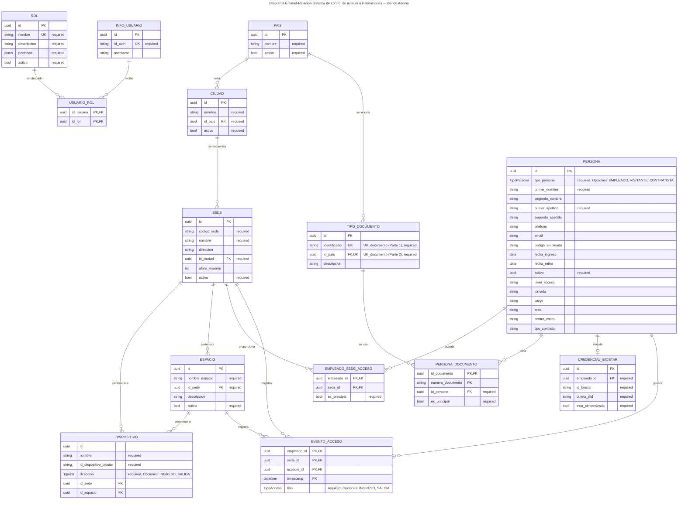

# Diagrama de entidad relación - Sistema de Control de Acceso a Instalaciones

```mermaid
---
title: "Diagrama Entidad-Relacion Sistema de control de acceso a instalaciones — Banco Andino"
---
erDiagram
    ROL ||--o{ USUARIO_ROL : "es otrogado"
    INFO_USUARIO ||--o{ USUARIO_ROL : recibe
    SEDE ||--o{ DISPOSITIVO : "pertenece a"
    ESPACIO ||--o{ DISPOSITIVO : "pertenece a"
    PAIS ||--o{ CIUDAD : esta
    CIUDAD ||--o{ SEDE : "se encuentra"
    PAIS ||--o{ TIPO_DOCUMENTO : "se vincula"
    SEDE ||--o{ ESPACIO : pertenece
    SEDE ||--o{ EMPLEADO_SEDE_ACCESO : proporciona
    PERSONA ||--o{ EMPLEADO_SEDE_ACCESO : accede
    PERSONA ||--o{ PERSONA_DOCUMENTO : tiene
    TIPO_DOCUMENTO ||--o{ PERSONA_DOCUMENTO : "se usa"
    PERSONA ||--o| CREDENCIAL_BIOSTAR : vincula
    SEDE ||--o{ EVENTO_ACCESO : registra
    ESPACIO ||--o{ EVENTO_ACCESO : registra
    PERSONA ||--o{ EVENTO_ACCESO : genera

    INFO_USUARIO {
        uuid id PK
        string id_auth UK "required"
        string username
    }
    ROL {
        uuid id PK
        string nombre UK "required"
        string descripcion "required"
        jsonb permisos "required"
        bool activo "required"
    }
    USUARIO_ROL {
        uuid id_usuario PK, FK
        uuid id_rol PK, FK
    }
    PAIS {
        uuid id PK
        string nombre "required"
        bool activo "required"
    }
    CIUDAD {
        uuid id PK
        string nombre "required"
        uuid id_pais FK "required"
        bool activo "required"
    }
    SEDE {
        uuid id PK
        string codigo_sede "required"
        string nombre "required"
        string direccion
        uuid id_ciudad FK "required"
        int aforo_maximo
        bool activo "required"
    }
    ESPACIO {
        uuid id PK
        string nombre_espacio "required"
        uuid id_sede FK "required"
        string descripcion
        bool activo "required"
    }
    DISPOSITIVO {
        uuid id
        string nombre "required"
        string id_dispositivo_biostar "required"
        TipoDir direccion "required, Opciones: INGRESO, SALIDA"
        uuid id_sede FK
        uuid id_espacio FK
    }
    TIPO_DOCUMENTO {
        uuid id PK
        string identificador UK "UK_documento (Parte 1), required"
        uuid id_pais FK, UK "UK_documento (Parte 2), required"
        string descripcion
    }
    PERSONA {
        uuid id PK
        TipoPersona tipo_persona "required, Opciones: EMPLEADO, VISITANTE, CONTRATISTA"
        string primer_nombre "required"
        string segundo_nombre
        string primer_apellido "required"
        string segundo_apellido
        string telefono
        string email
        string codigo_empleado
        date   fecha_ingreso
        date   fecha_retiro
        bool   activo "required"
        string nivel_acceso
        string jornada
        string cargo
        string area
        string centro_costo
        string tipo_contrato
    }
    PERSONA_DOCUMENTO {
        uuid id_documento PK, FK
        string numero_documento PK
        uuid id_persona FK "required"
        bool es_principal "required"
    }
    EMPLEADO_SEDE_ACCESO {
        uuid empleado_id PK, FK
        uuid sede_id PK, FK
        bool es_principal "required"
    }
    CREDENCIAL_BIOSTAR {
        uuid id PK
        uuid empleado_id FK "required"
        string id_biostar "required"
        string tarjeta_rfid "required"
        bool esta_sincronizado "required"
    }
    EVENTO_ACCESO {
        uuid empleado_id PK, FK
        uuid sede_id PK, FK
        uuid espacio_id PK, FK
        datetime timestamp PK
        TipoAcceso tipo "required, Opciones: INGRESO, SALIDA"
    }
```